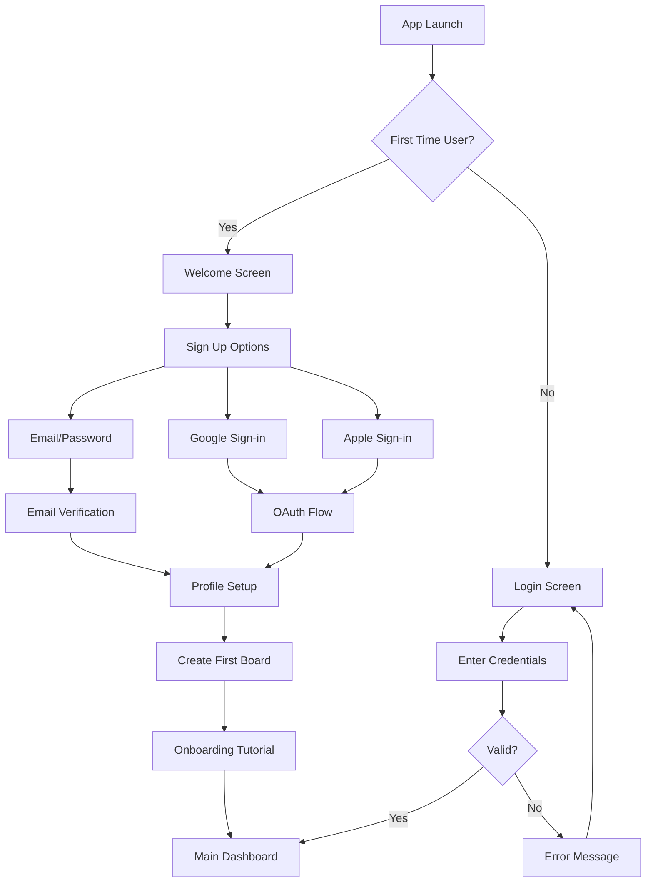
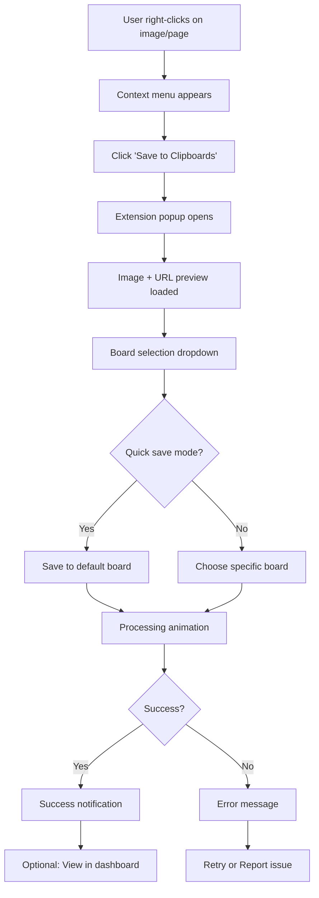
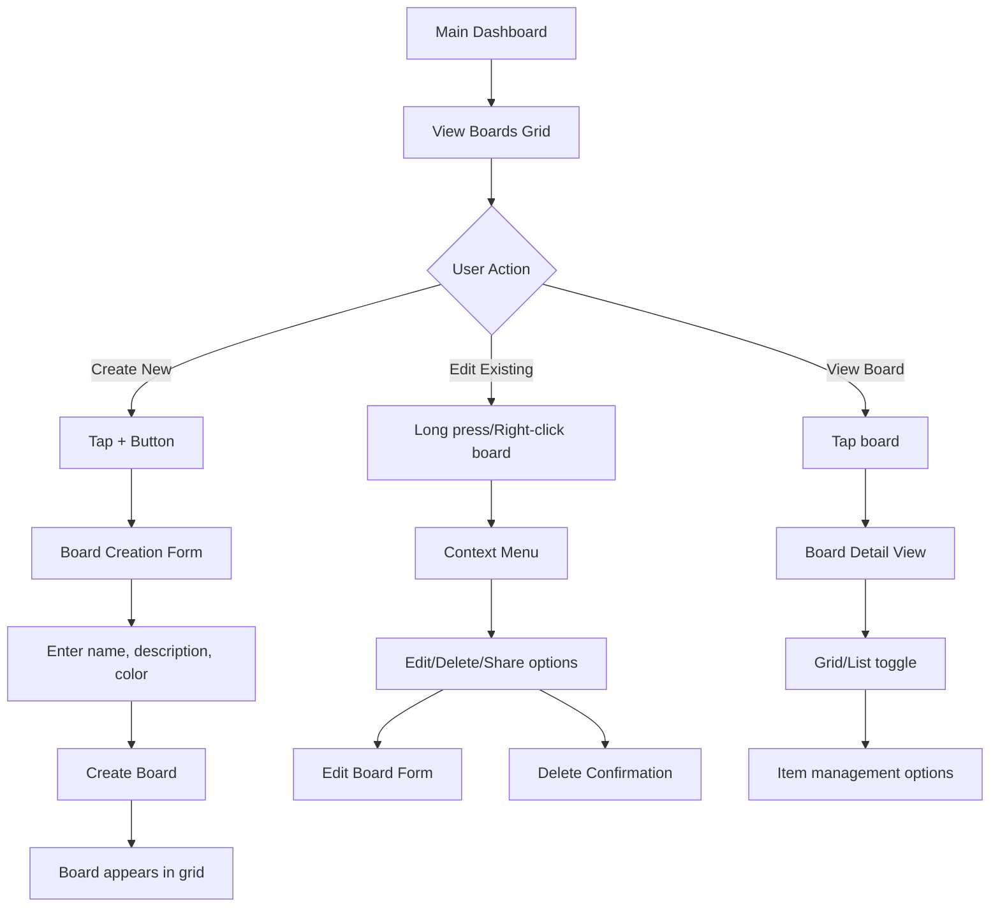
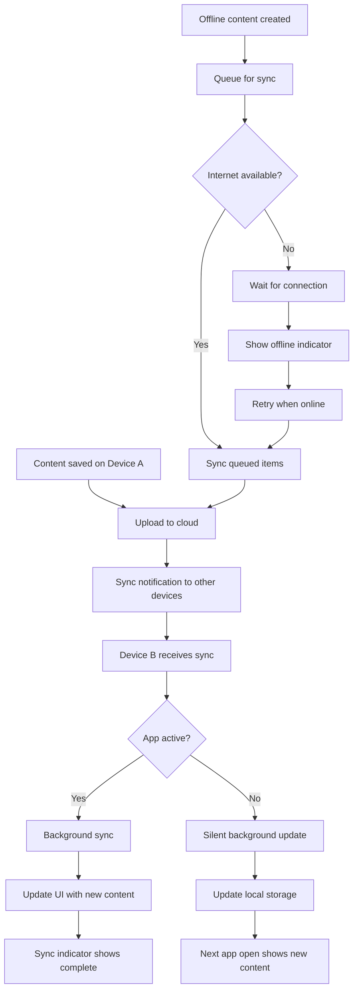
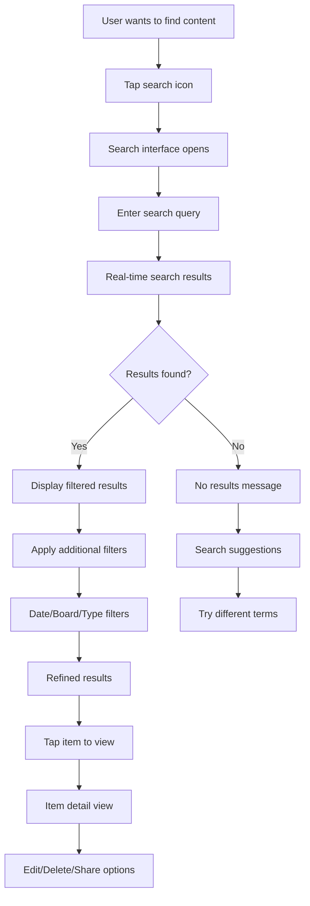
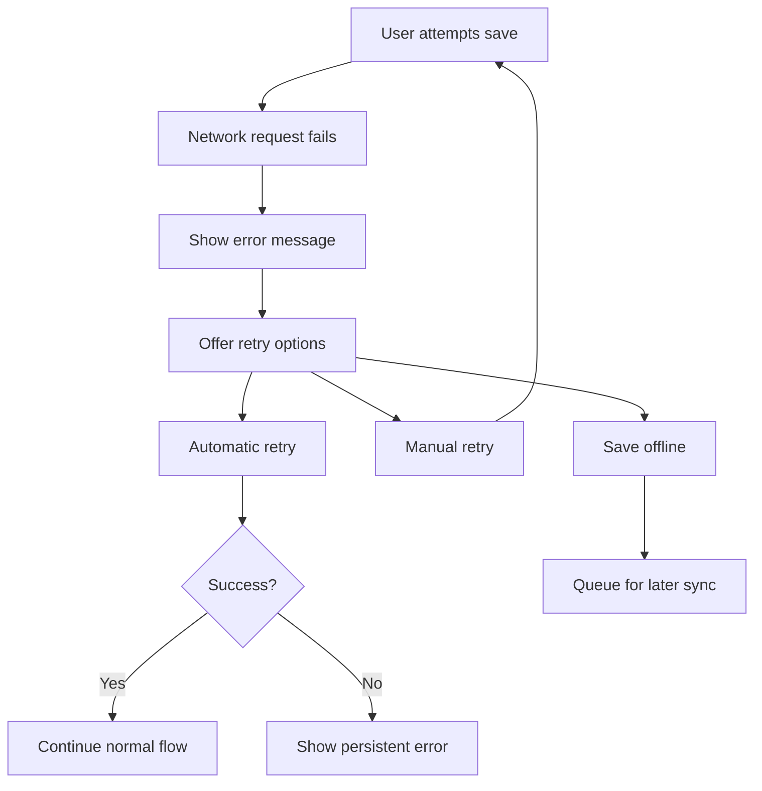
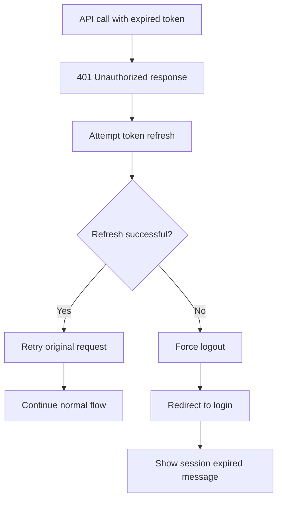

# UX Flow Diagrams

## Core User Flows

### 1. User Onboarding Flow



#### Key UX Principles
- **Quick Start**: Users can sign up and create their first board in under 2 minutes
- **Social Login Priority**: Google/Apple login prominently displayed
- **Progressive Disclosure**: Tutorial shows key features without overwhelming
- **Skip Options**: Users can skip non-essential steps and return later

### 2. Mobile Content Capture Flow

```mermaid
graph TD
    A[User finds content to save] --> B[Tap Share button]
    B --> C[Select Clipboards from share menu]
    C --> D[Clipboards share extension opens]
    D --> E{Image detected?}
    E -->|Yes| F[Preview image + URL]
    E -->|No| G[URL only preview]
    F --> H[Select destination board]
    G --> H
    H --> I[Add title/notes (optional)]
    I --> J[Tap Save]
    J --> K[Processing indicator]
    K --> L{Success?}
    L -->|Yes| M[Success feedback + View option]
    L -->|No| N[Error message + Retry]
    M --> O[Return to source app]
    N --> P[Retry or Cancel]
    P --> K
```

#### Mobile-Specific Considerations
- **Native Share Integration**: Appears in iOS share sheet and Android share menu
- **Quick Save**: Default board selection for one-tap saving
- **Offline Support**: Content queued for sync when online
- **Visual Feedback**: Clear progress indicators and success states

### 3. Browser Extension Capture Flow



#### Browser Extension UX
- **Context Awareness**: Automatically detects images and relevant content
- **Minimal Interruption**: Small popup that doesn't obstruct browsing
- **Keyboard Shortcuts**: Power users can save with Cmd/Ctrl+Shift+S
- **Bulk Save**: Option to save multiple images from a page

### 4. Board Management Flow



#### Board Management UX
- **Visual Organization**: Color-coded boards with preview thumbnails
- **Drag & Drop**: Reorder boards and move items between boards
- **Bulk Operations**: Select multiple items for batch actions
- **Smart Defaults**: Auto-suggest board names based on content

### 5. Cross-Platform Sync Flow



#### Sync UX Principles
- **Invisible When Working**: Users shouldn't notice sync when it's working
- **Clear When Failing**: Obvious indicators when sync is blocked
- **Offline Graceful**: Full functionality when offline with clear status
- **Conflict Resolution**: Automatic resolution with user notification if needed

### 6. Search and Discovery Flow



#### Search UX Features
- **Instant Search**: Results appear as user types
- **Search Scope**: Search within specific boards or across all content
- **Recent Searches**: Quick access to previous search terms
- **Smart Suggestions**: Auto-complete based on content and history

## Platform-Specific Flows

### iOS Share Extension Flow
```
Safari/Instagram/etc → Share Button → iOS Share Sheet → Clipboards Icon → 
Extension Opens → Board Selection → Save → Success Animation → Return to Source App
```

### Android Share Target Flow  
```
Chrome/Facebook/etc → Share Button → Android Share Menu → Clipboards Option →
Intent Received → Board Selection → Save → Toast Notification → Return to Source App
```

### Desktop Browser Flow
```
Right-click Image → Context Menu → "Save to Clipboards" → Extension Popup →
Board Selection → Save → Badge Notification → Continue Browsing
```

## Error Handling Flows

### Network Error Flow


### Authentication Error Flow


## Accessibility Considerations

### Screen Reader Support
- **Semantic HTML**: Proper heading hierarchy and ARIA labels
- **Image Alt Text**: Meaningful descriptions for saved images
- **Focus Management**: Logical tab order and focus indicators
- **Announcements**: Screen reader announcements for state changes

### Motor Accessibility
- **Touch Targets**: Minimum 44px touch targets on mobile
- **Keyboard Navigation**: Full functionality without mouse
- **Voice Control**: Compatible with voice navigation systems
- **Gesture Alternatives**: Alternative methods for swipe/pinch actions

### Visual Accessibility
- **Color Contrast**: WCAG AA compliance for all text
- **Font Sizes**: Scalable text that respects system settings
- **Color Independence**: Information not conveyed by color alone
- **High Contrast Mode**: Support for system high contrast settings

## Performance Considerations

### Loading States
- **Skeleton Screens**: Show content structure while loading
- **Progressive Loading**: Load critical content first
- **Image Lazy Loading**: Load images as they enter viewport
- **Infinite Scroll**: Pagination for large collections

### Offline Experience
- **Cached Content**: Previously viewed content available offline
- **Offline Actions**: Queue actions for when online
- **Network Status**: Clear indicators of online/offline state
- **Sync Status**: Visual feedback for sync progress

## User Testing Scenarios

### Scenario 1: New User Onboarding
**Goal**: Complete signup and save first item
**Success Criteria**: Under 3 minutes, no confusion points
**Key Metrics**: Time to completion, drop-off points

### Scenario 2: Cross-Platform Sync
**Goal**: Save on mobile, view on desktop
**Success Criteria**: Content appears on desktop within 5 seconds
**Key Metrics**: Sync time, user awareness of sync status

### Scenario 3: Bulk Organization
**Goal**: Organize 20+ saved items into relevant boards
**Success Criteria**: Complete task without frustration
**Key Metrics**: Task completion rate, time efficiency

### Scenario 4: Recovery from Error
**Goal**: Successfully save content after network error
**Success Criteria**: User understands error and completes action
**Key Metrics**: Error recovery rate, user satisfaction